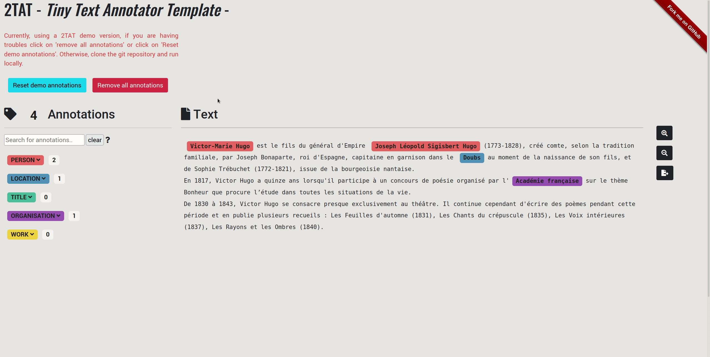

[](https://ttat-demo-app.herokuapp.com/) 


# 2TAT (*Tiny Text Annotator Template*)
 
 2TAT (Tiny Text Annotator Template) :  a customized text annotator experimentation (here for a named entity annotation task) canvas using Flask-[RecogitoJS](https://github.com/recogito/recogito-js)

:fast_forward: Demo on Heroku :  [here](https://ttat-demo-app.herokuapp.com/)
 


### What main features ?

- annotation by text selection;
- full-text search in annotated mentions;
- multiple deletion of same entities;
- annotation format export example ([W3C annotation data model](https://www.w3.org/TR/annotation-model/))


### Local Installation

1. Clone this repository

2. Create a virtualenv with `requirements.txt`

```bash
$ virtualenv --python=/usr/bin/python3.8 venv
$ source venv/bin/activate
$ pip -r install requirements.txt
```
3. Launch `run.py`
```bash
$ python run.py
```

### Test with other data

The demo version provides test data in the `data_demo` folder which contains :

- text to annotate (.txt)
- mapping that contain "Label" (key) and "Color" (Hex scheme, value)

Enter these paths in the `populate_database()` function accessible via `models` folder > `schema.py`.

Comment the part under "Populate database with annotations examples".

### Can I retrieve annotated data in this tool?
This is a reusable template that is not intended to be a persistent annotation platform but **you can still keep track of your work** after a few manipulations... 

1. Export your annotations in W3C data models format accessible in the annotation window next to the zoom;
2. convert this format in csv (exemple in `data_demo` folder with `demo_annotations_hugo_bio.csv`) with a script;
3. put its csv in the `data_demo` folder;
4. Comment or uncomment last lines of `populate_database()` function (see above);
5. restart `run.py`

...Its good

### Stack

- Recogito-JS : Javascript library for text annotation;
- Flask : Python backend;
- Bootstrap : web application interface design (CSS)
- the annotations are in the CSS style of DisplaCy (SpaCy)

### Possible improvements

- Fuzzy search in mentions;
- import management;
- Overlap detection;
- Part-of-speech tagging (possible with Recogito JS)
